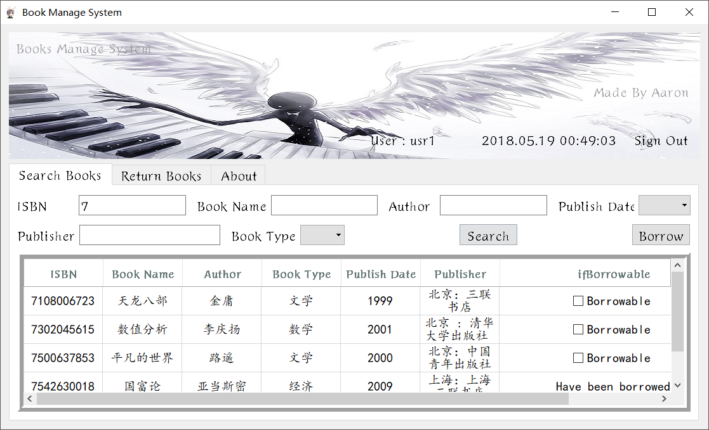
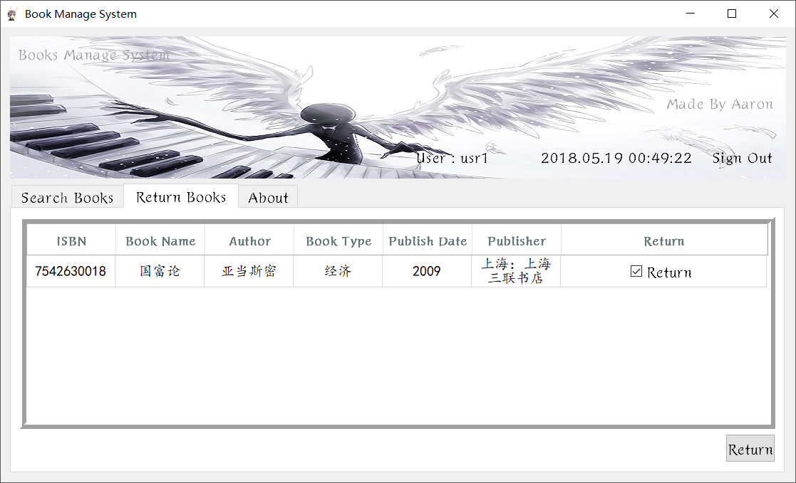
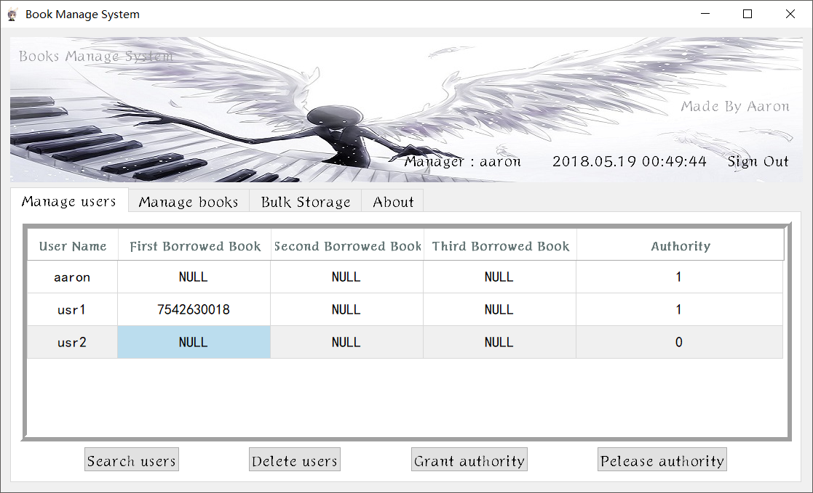
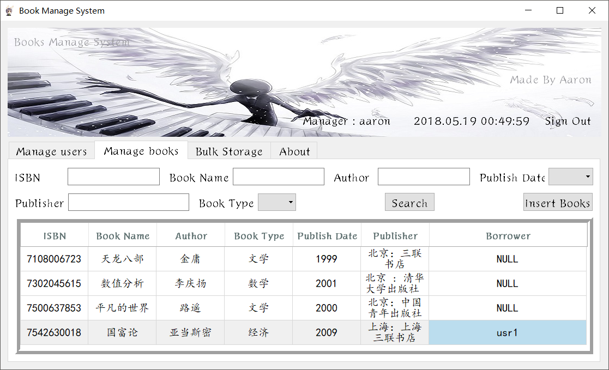
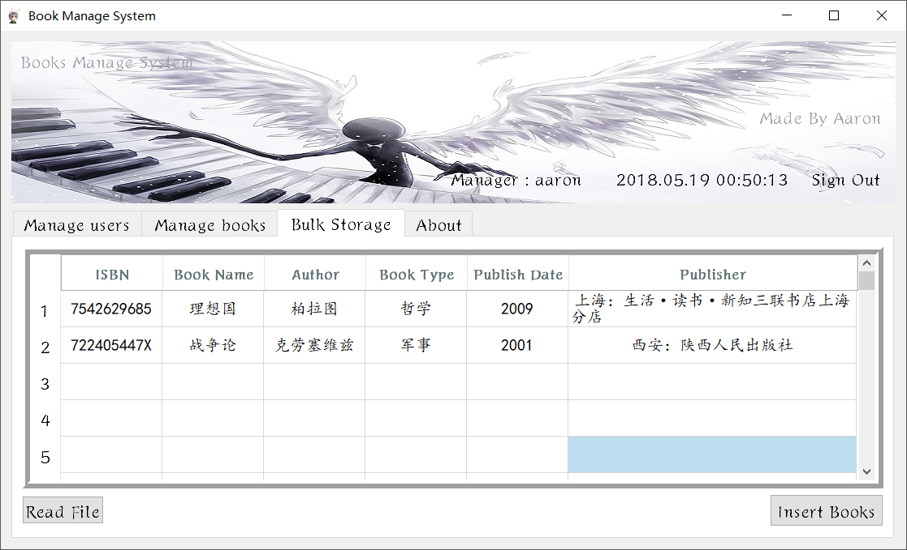

@(ZJU)
# 图书管理系统
*Made by Aaron*

---
- **主要功能**：图书管理系统，提供图书、用户和借阅管理功能
- **平台要求**：QT Creator 4.5 (community)
- **代码运行**: 利用QT creator打开.pro项目运行

---
- **数据库要求**
1. 自行建立数据库，并插入如下四张表。之后将代码database.cpp中数据库名称、用户名、密码进行更改。
``` sql
create table books(
ISBN varchar(10) not null,
bookname varchar(30) not null,
author varcahr(30) not null,
booktype varchar(30) not null,
publishdate int unsigned not null,
publisher varchar(30) not null,
isBorrowed tinyint unsigned not null
primary key(ISBN));

create table users(
username varcahr(30),
password varchar(120) not null,
authority tinyint unsigned,
primary key(username));

create table managers(
managername varchar(30),
password varcahr(120) not null,
primary key(managername));

create table book_borrow(
ISBN varchar(10) not null,
borrower varchar(30),
primary key(ISBN, borrower),
foreign key(borrower) references users(username));
```
2. 自行添加管理员账户与密码，直接对数据库中managers的表格进行操作即可。

3. 连接mysql与QT，请自行查阅。

---
- **功能展示**：
1. 主界面（游客界面）
   

2. 普通用户借阅图书界面

   

3. 普通用户归还图书界面

   

4. 管理员管理用户界面

   

5. 管理员管理图书界面

   

6. 管理员批量入库界面

   

---
